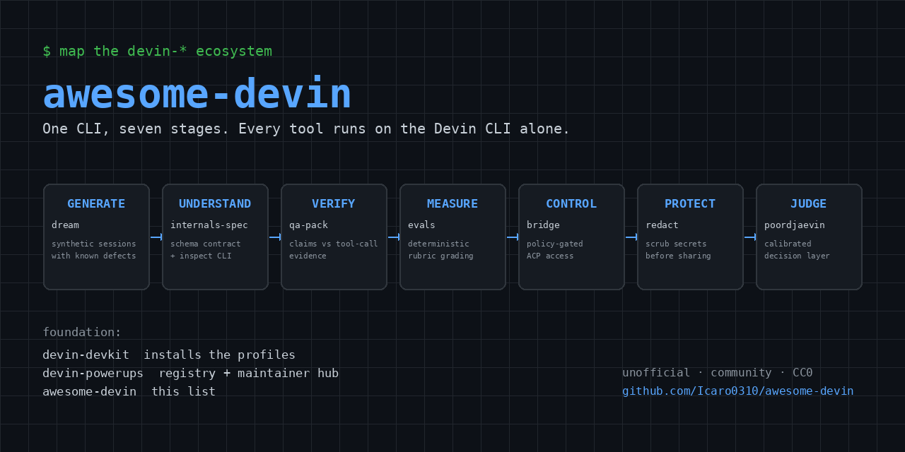

# awesome-devin

A curated list of resources for **Devin** — the AI software engineer by Cognition — and the `devin-*` open-source tooling ecosystem.

> **This is not an official Cognition repository.** It is an unofficial community project, not affiliated with, endorsed by, or sponsored by Cognition AI. "Devin" is a trademark of Cognition AI. For official documentation and support, see [Official Resources](#official-resources).

## Start here

1. [devin-doctor](https://github.com/Icaro0310/devin-doctor) — diagnose the local Devin install and stores.
2. [devin-qa-pack](https://github.com/Icaro0310/devin-qa-pack) — flagship audit of agent claims against tool-call evidence.
3. [devin-office](https://github.com/Icaro0310/devin-office) — watch live sessions as an animated circuit board.
4. [devin-devkit](https://github.com/Icaro0310/devin-devkit) — install the registry-supported profiles for Linux, Personal Windows or Corporate Windows.

## Contents

- [Official Resources](#official-resources)
- [Ecosystem Catalog](#ecosystem-catalog)
- [FAQ](#faq)
- [Community & Adjacent Lists](#community--adjacent-lists)
- [Contributing](#contributing)

## Official Resources

**Product**

- [Devin](https://devin.ai) — the AI software engineer.
- [Devin Documentation](https://docs.devin.ai) — official product docs.
- [Devin CLI](https://docs.devin.ai/work-with-devin/devin-cli) — run Devin in your terminal, hand off to cloud sessions with `/handoff`.
- [Ask Devin](https://docs.devin.ai/work-with-devin/ask-devin) — codebase Q&A, task planning, high-context sessions.
- [Devin Review](https://docs.devin.ai/work-with-devin/devin-review) — review and understand complex PRs.

**Programmatic surface**

- [Devin API v3](https://docs.devin.ai/api-reference/overview) — sessions, knowledge, playbooks, secrets, automations and analytics, with service users and org/enterprise RBAC.
- [Devin MCP](https://docs.devin.ai/work-with-devin/devin-mcp) — official MCP server: external agents can manage sessions, playbooks, knowledge, and repository docs.
- [MCP servers & marketplace](https://docs.devin.ai/work-with-devin/mcp) — connect external tools to Devin via MCP (STDIO, SSE, HTTP).
- [DeepWiki](https://deepwiki.com) + [DeepWiki MCP](https://docs.devin.ai/work-with-devin/deepwiki-mcp) — auto-generated docs and architecture diagrams for public repos; free MCP server (`ask_question`, `read_wiki_structure`, `read_wiki_contents`).
- [Python SDK](https://docs.devin.ai/federal/api/python-sdk) — analytics, groups, and ACU limits from Python.

**Agentic configuration**

- [Devin Skills](https://docs.devin.ai/product-guides/skills) — reusable `SKILL.md` procedures committed to repos, following the Agent Skills standard.
- [Devin Plugins](https://docs.devin.ai/product-guides/plugins) — versioned bundles of skills, rules, MCP servers, hooks, and subagents, with org/enterprise governance.
- [Playbooks](https://docs.devin.ai/product-guides/using-playbooks) — reusable org-shared prompts attached to sessions via macros.
- [Devin Memory & Dreaming](https://docs.devin.ai/product-guides/memory) — cross-session preference and lesson notes, organized automatically.
- [Integrations](https://docs.devin.ai/integrations/overview) — Slack, Teams, Linear, GitHub, PagerDuty, MCP.

**Operations**

- [Session Insights](https://docs.devin.ai/product-guides/session-insights) — analyze completed sessions, knowledge usage, and prompt coaching.
- [Scheduled Sessions & Automations](https://docs.devin.ai/product-guides/scheduled-sessions) — recurring and trigger-based work.
- [Security Profiles](https://docs.devin.ai/product-guides/security-profiles) — org-level restrictions on network, MCP, git, and `gh` access.
- [Personal Analytics](https://docs.devin.ai/enterprise/security-access/personal-analytics) — the official ACU consumption view (what local stores cannot tell you about cost).

## Ecosystem Catalog

One registry ([devin-powerups](https://github.com/Icaro0310/devin-powerups)) is the source of truth; [devin-devkit](https://github.com/Icaro0310/devin-devkit) is the distribution layer that installs it. Reusable tooling that runs on the Devin CLI alone — no VM, tunnel, or external model server required. Linux, Personal Windows and Corporate Windows are supported; Corporate Windows runs the registry-approved local-only subset.

### Distribution & Infrastructure

- [devin-devkit](https://github.com/Icaro0310/devin-devkit) — distribution: choose QA, evaluation, security, memory, operations or full profiles under Linux, Personal Windows or the explicit Corporate Windows local-only mode; installs Python CLIs in isolated environments with uv.
  

type · interfaces · platforms

  - **Type:** distribution
  - **Interfaces:** cli, installer
  - **Platforms:** Windows, Linux
  

- [devin-powerups](https://github.com/Icaro0310/devin-powerups) — maintainer hub: registry source of truth, project template, catalog exporters and scheduled reports.
  

type · interfaces · platforms

  - **Type:** infrastructure
  - **Interfaces:** cli, registry, docs
  - **Platforms:** Windows, Linux
  

### Related Artifacts

- [poordjaevin](https://github.com/Icaro0310/poordjaevin) — related tool: local-first calibrated decision layer ("System One") with typed questions, honest confidence, ACP backend on Devin's own model, and offline NLI fallback.
  

type · interfaces · platforms

  - **Type:** tool
  - **Interfaces:** cli, library, mcp, bridge
  - **Platforms:** Windows, Linux
  

- [qwenpaw-suite](https://github.com/Icaro0310/qwenpaw-suite) — related suite: optional self-hosted-model add-on; not required by the core tools.
  

type · interfaces · platforms

  - **Type:** suite
  - **Interfaces:** service, bridge, docs
  - **Platforms:** Windows, Linux
  

### Decision & QA Layer

- [devin-qa-pack](https://github.com/Icaro0310/devin-qa-pack) — flagship QA audit: PASS/PARTIAL/UNVERIFIED from tool-call evidence.
  

type · interfaces · platforms

  - **Type:** tool
  - **Interfaces:** cli
  - **Platforms:** Windows, Linux
  

- [devin-evals](https://github.com/Icaro0310/devin-evals) — evaluation harness for agent outputs.
  

type · interfaces · platforms

  - **Type:** tool
  - **Interfaces:** cli, library
  - **Platforms:** Windows, Linux
  

- [devin-janitor](https://github.com/Icaro0310/devin-janitor) — session cleanup with judge policies before deletion.
  

type · interfaces · platforms

  - **Type:** tool
  - **Interfaces:** cli, automation
  - **Platforms:** Windows, Linux
  

- [devin-dream](https://github.com/Icaro0310/devin-dream) — synthetic Devin sessions with known verdicts, for testing judges and graders.
  

type · interfaces · platforms

  - **Type:** tool
  - **Interfaces:** cli, library
  - **Platforms:** Windows, Linux
  

### Configuration & Learning

- [devin-doctor](https://github.com/Icaro0310/devin-doctor) — diagnostics for Devin CLI installs: config, stores, schema checks.
  

type · interfaces · platforms

  - **Type:** tool
  - **Interfaces:** cli
  - **Platforms:** Windows, Linux
  

- [devin-internals-spec](https://github.com/Icaro0310/devin-internals-spec) — reverse-engineered notes on Devin CLI internals (sessions DB, ACP, state).
  

type · interfaces · platforms

  - **Type:** tool
  - **Interfaces:** cli, library
  - **Platforms:** Windows, Linux
  

- [devin-skill-catalog](https://github.com/Icaro0310/devin-skill-catalog) — inventory, lint and quarantine for `.devin/skills` and rules, with G1/G2 gates.
  

type · interfaces · platforms

  - **Type:** tool
  - **Interfaces:** cli, registry
  - **Platforms:** Windows, Linux
  

- [devin-switch](https://github.com/Icaro0310/devin-switch) — swap Devin config profiles (hooks, MCP, models) with snapshot, dry-run and rollback.
  

type · interfaces · platforms

  - **Type:** tool
  - **Interfaces:** cli
  - **Platforms:** Windows, Linux
  

### Data, History & Search

- [devin-history](https://github.com/Icaro0310/devin-history) — export and inspect Devin session history from the local sessions DB.
  

type · interfaces · platforms

  - **Type:** tool
  - **Interfaces:** cli
  - **Platforms:** Windows, Linux
  

- [devin-memory](https://github.com/Icaro0310/devin-memory) — persistent memory layer for Devin sessions.
  

type · interfaces · platforms

  - **Type:** tool
  - **Interfaces:** cli, library, mcp, service
  - **Platforms:** Windows, Linux
  

- [devin-search](https://github.com/Icaro0310/devin-search) — full-text search across sessions and artifacts.
  

type · interfaces · platforms

  - **Type:** tool
  - **Interfaces:** cli
  - **Platforms:** Windows, Linux
  

- [devin-graph](https://github.com/Icaro0310/devin-graph) — session and artifact relationships as a graph.
  

type · interfaces · platforms

  - **Type:** tool
  - **Interfaces:** cli, library
  - **Platforms:** Windows, Linux
  

- [devin-backup](https://github.com/Icaro0310/devin-backup) — snapshot and restore Devin CLI data.
  

type · interfaces · platforms

  - **Type:** tool
  - **Interfaces:** cli
  - **Platforms:** Windows, Linux
  

- [devin-redact](https://github.com/Icaro0310/devin-redact) — scrub secrets from exports before sharing.
  

type · interfaces · platforms

  - **Type:** tool
  - **Interfaces:** cli, library
  - **Platforms:** Windows, Linux
  

### Operations

- [devin-pm](https://github.com/Icaro0310/devin-pm) — project-management workflows on top of Devin.
  

type · interfaces · platforms

  - **Type:** tool
  - **Interfaces:** cli, registry
  - **Platforms:** Windows, Linux
  

- [devin-metrics](https://github.com/Icaro0310/devin-metrics) — local session observability: activity, context size and token peaks; no persisted cost fields.
  

type · interfaces · platforms

  - **Type:** tool
  - **Interfaces:** cli, dashboard
  - **Platforms:** Windows, Linux
  

- [devin-bridge](https://github.com/Icaro0310/devin-bridge) — ACP client bridge for the Devin CLI (requires Node.js >= 20).
  

type · interfaces · platforms

  - **Type:** tool
  - **Interfaces:** cli, bridge
  - **Platforms:** Windows, Linux
  

- [devin-orchestrator](https://github.com/Icaro0310/devin-orchestrator) — multi-tool orchestration across the ecosystem.
  

type · interfaces · platforms

  - **Type:** tool
  - **Interfaces:** cli, automation
  - **Platforms:** Windows, Linux
  

- [devin-office](https://github.com/Icaro0310/devin-office) — live Devin activity as an animated SVG circuit board: sessions, subagents, tools.
  

type · interfaces · platforms

  - **Type:** tool
  - **Interfaces:** service, dashboard
  - **Platforms:** Windows, Linux
  

## FAQ

**Is this affiliated with Cognition AI?**
No. This is an unofficial community project. For official resources, see [Official Resources](#official-resources).

**Do I need Devin installed?**
Not to explore. `devin-dream` generates synthetic sessions with labeled defects, and the [Agent Assurance demo](https://github.com/Icaro0310/devin-qa-pack/tree/main/examples/agent-assurance) runs end-to-end with only `git` + `curl`. The production tools do read local Devin CLI data, so they are most useful on machines where Devin CLI actually runs.

**Does it cost anything?**
The tools are open source and local-first — no accounts, no telemetry, no API keys for the core catalog. `poordjaevin`'s optional ACP backend reuses the model your Devin CLI already runs.

**Does it work on Windows?**
Yes. Linux and Personal Windows run the full catalog. Corporate Windows is supported through the explicit `devin-devkit` local-only profile, which installs the registry-approved subset — no VM, tunnel, or external compute required.

**Where do I start if I only try one thing?**
`devin-doctor` to see what your install looks like, then the [Agent Assurance demo](https://github.com/Icaro0310/devin-qa-pack/tree/main/examples/agent-assurance) to watch claims-vs-evidence auditing run on generated sessions.

**How do I suggest a resource?**
Open a [suggestion issue](https://github.com/Icaro0310/awesome-devin/issues/new?template=suggest-resource.yml) or a pull request.

## Community & Adjacent Lists

Curated lists in the same neighborhood — different scope, worth browsing:

- [e2b-dev/awesome-devins](https://github.com/e2b-dev/awesome-devins) — the landscape of "Devin-inspired" open and closed-source AI agents.
- [e2b-dev/awesome-ai-sdks](https://github.com/e2b-dev/awesome-ai-sdks) — SDKs and frameworks for building AI agents.
- [bradAGI/awesome-cli-coding-agents](https://github.com/bradAGI/awesome-cli-coding-agents) — terminal-native coding agents and the harnesses that orchestrate them.
- [ai-for-developers/awesome-ai-coding-tools](https://github.com/ai-for-developers/awesome-ai-coding-tools) — AI-powered coding tools across editors, CLIs, and agents.
- [punkpeye/awesome-mcp-servers](https://github.com/punkpeye/awesome-mcp-servers) — the canonical MCP server directory.
- [atinfo/awesome-test-automation](https://github.com/atinfo/awesome-test-automation) — test automation frameworks and tools across languages.
- [kmaasrud/awesome-obsidian](https://github.com/kmaasrud/awesome-obsidian) — Obsidian plugins, themes, and workflows.

## What is this list?

An awesome list for **Devin** — the AI software engineer by Cognition AI —
and the open-source tooling built around its CLI. It answers two questions:
"what official resources exist for Devin?" and "what community tools extend
it?". Every entry links to its own repo with a one-line description; the list
itself contains no code. Core ecosystem tools run on the Devin CLI alone,
locally, across Linux, Personal Windows and the Corporate Windows local-only
subset. Community-maintained; not affiliated with, endorsed by, or sponsored
by Cognition AI.

## Contributing

Suggestions via the [suggest-a-resource issue template](https://github.com/Icaro0310/awesome-devin/issues/new?template=suggest-resource.yml) or pull requests. Entries must relate to Devin (CLI, API, sessions, or the devin-* tools) and include a one-line description.

## License

CC0 — public domain.
